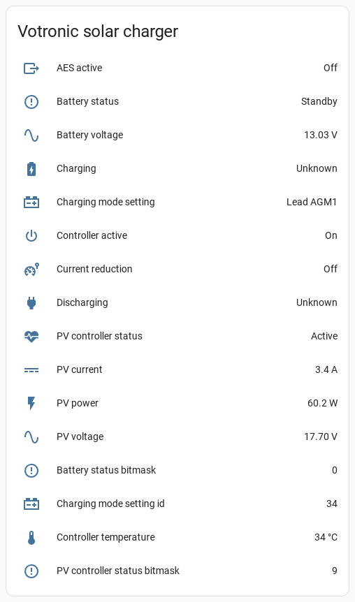

# esphome-votronic

ESPHome component to monitor votronic devices via BLE or Display Link

## Setup

* [BLE communication via the Bluetooth Controller](votronic_bluetooth.md)
* [Wired communication using the Display Link interface](votronic_display_link.md)

## References

* https://github.com/heeplr/votronic
* https://github.com/TheRealMoeder/vosodi
* https://github.com/crathje/VotronicSRDuoDig
* https://github.com/SirReal-surreal/SirReal-surreal/blob/main/2021_08_16_Votronic.json
* https://codeberg.org/scy/votonic
* https://cumulumbus.de/smart-camper-auslesen-der-batterie-und-solarinformationen-aus-dem-votronic-bluetooth-connector/
