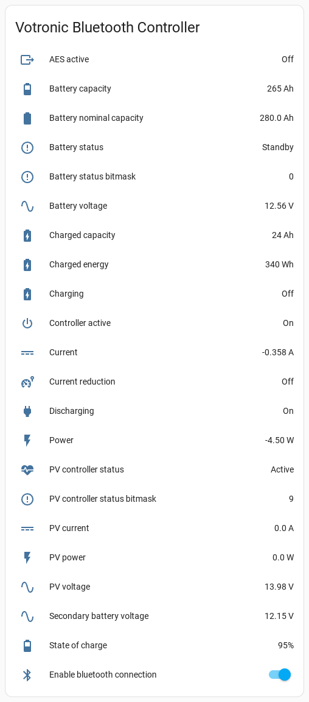

# esphome-votronic


[](https://www.buymeacoffee.com/syssi)

ESPHome component to monitor votronic devices via BLE or Display Link



## Supported devices

* Bluetooth Connector S-BC
  * Solar Charger SR/MPP since 2014 (S/N 14Vxx.xxxxx)
  * Battery Computer S + Smart Shunt

## Untested devices

* Battery Charger VBCS-Triple
* VPC Jupiter + Smart Shunt

## Requirements

* [ESPHome 2023.7.0 or higher](https://github.com/esphome/esphome/releases).
* Generic ESP32 board

## Installation

You can install this component with [ESPHome external components feature](https://esphome.io/components/external_components.html) like this:
```yaml
external_components:
  - source: github://syssi/esphome-votronic@main
```

or just use the `esp32-ble-example.yaml` as proof of concept:

```bash
# Install esphome
pip3 install esphome

# Clone this external component
git clone https://github.com/syssi/esphome-votronic.git
cd esphome-votronic

# Create a secrets.yaml containing some setup specific secrets
cat > secrets.yaml <<EOF
wifi_ssid: MY_WIFI_SSID
wifi_password: MY_WIFI_PASSWORD

mqtt_host: MY_MQTT_HOST
mqtt_username: MY_MQTT_USERNAME
mqtt_password: MY_MQTT_PASSWORD
EOF

# Validate the configuration, create a binary, upload it, and start logs
esphome run esp32-ble-example.yaml

```

## Pairing / Bonding

1. Turn `off` the `enable bluetooth connection` switch or remove the power from the ESP
2. Short press the pairing button (`key`) of the Bluetooth Connector
3. Turn `on` the `enable bluetooth connection` switch or power on the ESP
4. If pairing was successful, both LEDs will light up simultaneously

## Example response all sensors enabled

```
# Battery computer
[sensor:127]: 'votronic battery capacity remaining': Sending state 265.00000 Ah with 0 decimals of accuracy
[sensor:127]: 'votronic state of charge': Sending state 95.00000 % with 0 decimals of accuracy
[sensor:127]: 'votronic current': Sending state -0.35800 A with 3 decimals of accuracy
[binary_sensor:036]: 'votronic charging': Sending state OFF
[binary_sensor:036]: 'votronic discharging': Sending state ON
[sensor:127]: 'votronic battery nominal capacity': Sending state 280.00000 Ah with 1 decimals of accuracy
[sensor:127]: 'votronic secondary battery voltage': Sending state 12.15000 V with 2 decimals of accuracy
[sensor:127]: 'votronic battery voltage': Sending state 12.56000 V with 2 decimals of accuracy

# Solar charger
[sensor:127]: 'votronic pv current': Sending state 0.00000 A with 1 decimals of accuracy
[sensor:127]: 'votronic battery status bitmask': Sending state 0.00000  with 0 decimals of accuracy
[text_sensor:067]: 'votronic battery status': Sending state 'Unknown (0x00)'
[sensor:127]: 'votronic pv controller status bitmask': Sending state 9.00000  with 0 decimals of accuracy
[text_sensor:067]: 'votronic pv controller status': Sending state 'Active'
[sensor:127]: 'votronic charged capacity': Sending state 24.00000 Ah with 0 decimals of accuracy
[sensor:127]: 'votronic charged energy': Sending state 340.00000 Wh with 0 decimals of accuracy
[sensor:127]: 'votronic pv power': Sending state 0.00000 W with 1 decimals of accuracy
```

## Protocol

```
# Battery status frame
<<< 0xE8 0x04 0xBF 0x04 0x09 0x01 0x60 0x00 0x5F 0x00 0x9A 0xFE 0xFF 0xF0 0x0A 0x5E 0x14 0x54 0x02 0x04

# MPPT status frame
<<< 0xE8 0x04 0x76 0x05 0x00 0x00 0x00 0x00 0x00 0x06 0x56 0x00 0x09 0x18 0x00 0x22 0x00 0x00 0x00
```

## Known issues

None.

## Debugging

If this component doesn't work out of the box for your device please update your configuration to increase the log level to see details about the BLE communication and incoming traffic:

```
logger:
  level: VERY_VERBOSE
  logs:
    component: DEBUG
    scheduler: INFO
    mqtt: INFO
    mqtt.idf: INFO
    mqtt.component: INFO
    mqtt.sensor: INFO
    mqtt.switch: INFO
    esp32_ble_tracker: DEBUG
```

## References

* https://cumulumbus.de/smart-camper-auslesen-der-batterie-und-solarinformationen-aus-dem-votronic-bluetooth-connector/
