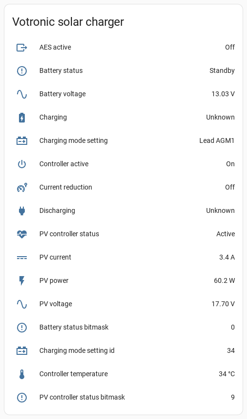

# esphome-votronic


[](https://www.buymeacoffee.com/syssi)

ESPHome component to monitor votronic devices via Display Link



## Supported devices

* Solar Charger SR (1610, 1615, 1620, 1625) (since mid 2014)
* Solar Charger MPP / CI (1710, 1715, 1720, 1725, 1711, 1716, 1721, 1726) (since mid 2014)
* VBCS Triple (3242, 3244, 3246, 3241, 3243, 3245)
* VAC Triple (0664, 0666, 0663, 0665)
* VCC Charging Converter 1212-30 (3324, 3321)
* VCC Charging Converter 1290 (3326, 3328, 3323, 3325, 3327, 3329)
* Smart Shunt

## Requirements

* [ESPHome 2023.7.0 or higher](https://github.com/esphome/esphome/releases).
* A wire with RJ11 western connector
* Generic ESP32 or ESP8266 board

## Schematics

```
                UART-TTL
┌──────────┐                  ┌─────────┐
│          │TX ──────────── RX│         │
│ Votronic │RX ──────────── TX│ ESP32/  │
│  Device  │GND ────────── GND│ ESP8266 │── 3.3V
│          │                  │         │── GND
└──────────┘                  └─────────┘

 RJ11 plug
(front view)
   ┌──┐
┌──┘  └──┐
│        │                      ESP8266
└─OOOOOO─┘
  ││││││
  │││││└────── 6 GND ────────── GND
  ││││└─────── 5 RXD ────────── GPIO4 (`tx_pin`)
  │││└──────── 4 GND
  ││└───────── 3 DNC
  │└────────── 2 VBAT+
  └─────────── 1 TXD ────────── GPIO5 (`rx_pin`)
```

The connector is a 6 Pin RJ11 western connector. It's important to not connect pin 3. It must be floating. The maximum allowed current of all pins is 50 mA. Please don't try to power the ESP using VBAT+.

## Installation

You can install this component with [ESPHome external components feature](https://esphome.io/components/external_components.html) like this:
```yaml
external_components:
  - source: github://syssi/esphome-votronic@main
```

or just use the `esp8266-solar-charger-example.yaml` as proof of concept:

```bash
# Install esphome
pip3 install esphome

# Clone this external component
git clone https://github.com/syssi/esphome-votronic.git
cd esphome-votronic

# Create a secrets.yaml containing some setup specific secrets
cat > secrets.yaml <<EOF
wifi_ssid: MY_WIFI_SSID
wifi_password: MY_WIFI_PASSWORD

mqtt_host: MY_MQTT_HOST
mqtt_username: MY_MQTT_USERNAME
mqtt_password: MY_MQTT_PASSWORD
EOF

# Validate the configuration, create a binary, upload it, and start logs
esphome run esp8266-solar-charger-example.yaml

```

## Example response all sensors enabled

```
TBD.
```

## Protocol

```
TBD.
```

## Known issues

None.

## Debugging

If this component doesn't work out of the box for your device please update your configuration to increase the log level to see details about the incoming traffic:

```
logger:
  level: VERY_VERBOSE
  logs:
    component: DEBUG
    scheduler: INFO
    binary_sensor: DEBUG
    sensor: DEBUG
    text_sensor: DEBUG

uart:
  - id: uart0
    baud_rate: 1000
    tx_pin: ${tx_pin}
    rx_pin: ${rx_pin}
    debug:
      direction: BOTH
      dummy_receiver: false
```

## References

* https://github.com/heeplr/votronic
* https://github.com/TheRealMoeder/vosodi
* https://github.com/crathje/VotronicSRDuoDig
* https://github.com/SirReal-surreal/SirReal-surreal/blob/main/2021_08_16_Votronic.json


